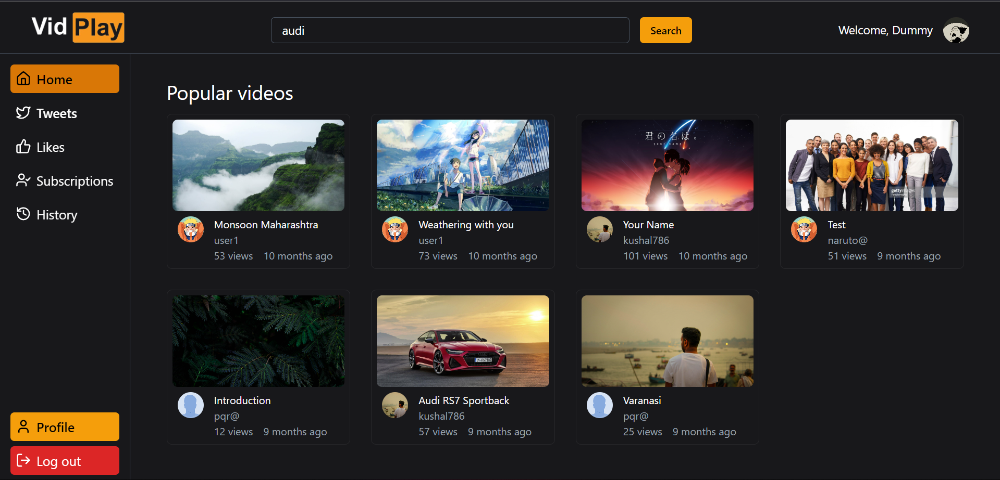

# 📺 VidPlay - Video Sharing Platform

**VidPlay** is a modern video-sharing web app that allows users to upload, stream, and interact with videos. Inspired by YouTube and built for seamless social sharing, it offers a clean, responsive UI with essential social features like likes and comments.

---

## 🚀 Features

- 🔐 **User Authentication**: Secure login & signup.
- 📤 **Video Upload**: Easily upload and share videos.
- ▶️ **Video Playback**: Smooth streaming experience.
- ❤️ **Likes & Comments**: Engage with video content.
- 👤 **User Profiles**: Track uploaded videos and interactions.
- 🔍 **Search & Filter (optional)**: Find videos quickly.
- 📱 **Responsive UI**: Mobile-friendly design.
- ⚙️ **RESTful API**: Cleanly separated backend logic.

---

## 🛠️ Tech Stack

| Category     | Technology          | Description                           |
| ------------ | ------------------- | ------------------------------------- |
| **Frontend** | React, Shadcn UI    | Modern UI & component design          |
|              | Tailwind CSS        | Utility-first styling                 |
| **Backend**  | Node.js, Express.js | RESTful API for business logic        |
| **Database** | MongoDB             | Stores users, videos, comments, likes |
| **Other**    | Vercel              | Deployment                            |

---

## 📦 Getting Started

### 📋 Prerequisites

- Node.js v16+
- MongoDB (local or Atlas)
- npm / yarn

### ⚙️ Installation

```bash
git clone https://github.com/Kushal3502/VidPlay.git
cd VidPlay
npm install
```

### ▶️ Running Locally

```bash
npm run dev
```

Navigate to `http://localhost:3000` in your browser.

---

## 🌐 Live Demo

- 🔗 [Live Site](https://vid-play-beta.vercel.app/)
- 📂 [GitHub Repo](https://github.com/Kushal3502/VidPlay)

---

## 📸 Screenshots

<!-- Add screenshots here -->




---

## 🤝 Contributing

Want to contribute? Fork the repo and submit a PR!

```bash
git checkout -b feature/my-feature
git commit -m "Add my feature"
git push origin feature/my-feature
```

---
